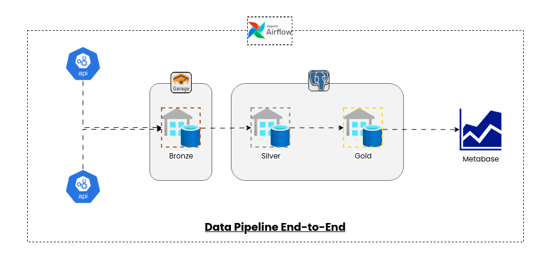
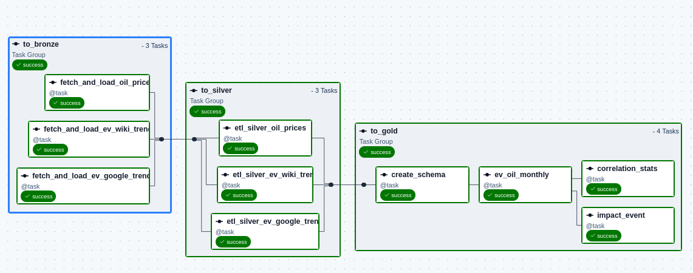
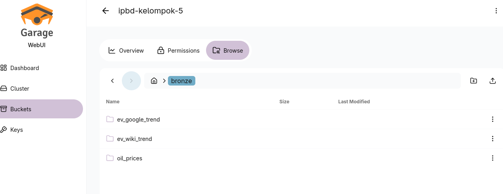
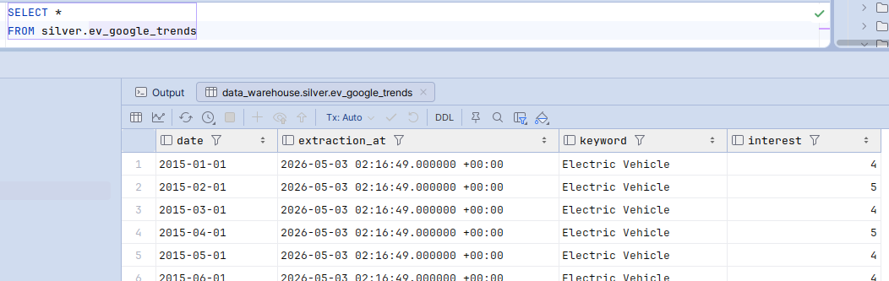
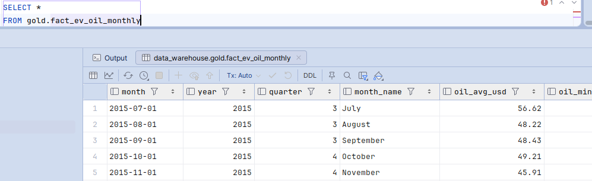
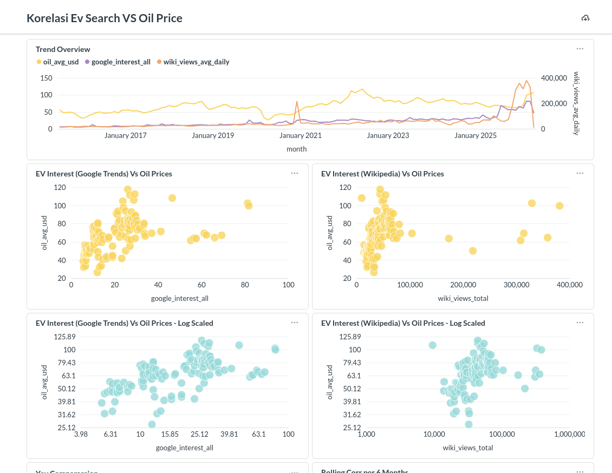

# ipbd-kelompok-5

Pipeline data engineering berbasis Apache Airflow untuk mengolah tren kendaraan listrik (EV) dan harga minyak. Data mentah disimpan ke data lake (Garage/S3), diproses ke data warehouse (PostgreSQL), lalu diringkas ke tabel analitik untuk visualisasi di Metabase.

## Gambaran Arsitektur
Alur utama mengikuti pola medallion: bronze (raw) → silver (cleaned) → gold (facts/insights).


Caption: Diagram arsitektur pipeline end-to-end.

## Orkestrasi DAG Airflow
Seluruh tahapan ingestion dan transformasi dijalankan oleh DAG Airflow yang mengatur urutan bronze → silver → gold.
Tampilan DAG bisa dilihat di https://airflow.ipbd.prayudahlah.dev.


Caption: Alur DAG untuk ingestion dan transformasi.

## Lapisan Data
Data disusun dalam tiga lapisan utama:
- **Bronze**: data mentah dari sumber eksternal disimpan di data lake (Garage/S3).
- **Silver**: data dibersihkan dan distandarkan ke PostgreSQL.
- **Gold**: tabel fakta untuk analitik (tren bulanan, dampak event, korelasi EV vs minyak).


Caption: Penyimpanan data mentah pada data lake.


Caption: Tabel intermediate yang sudah dibersihkan.


Caption: Tabel fakta untuk analitik.

## Sumber Data
- **Google Trends**: tren pencarian terkait EV.
- **Wikipedia Pageviews**: ketertarikan publik melalui pageviews EV.
- **Harga Minyak (Brent)**: data historis dari sumber finansial.

## Output Analitik
Hasil akhir digunakan untuk analisis tren bulanan, dampak event, serta korelasi EV vs minyak.
Dashboard publik dapat diakses di https://metabase.ipbd.prayudahlah.dev/public/dashboard/77dd3122-85c8-4a68-869e-04803bc28853.


Caption: Contoh dashboard analitik.

## Tech Stack
- Apache Airflow
- Python (pandas, polars, pytrends, yfinance)
- Garage (S3-compatible)
- PostgreSQL
- Metabase

## Setup Environment
1. Salin file env contoh:
   ```bash
   cp .env.example .env
   ```
2. Isi variabel pada `.env` sesuai environment kamu.
3. Untuk `GARAGE_WEBUI_HASHED_PASSWORD`, gunakan bcrypt:
   - **Utama (htpasswd):**
     ```bash
     htpasswd -nbBC 10 <user> <password> | cut -d: -f2
     ```
   - **Fallback (Python + bcrypt):**
     ```bash
     python - <<'PY'
     import bcrypt
     pwd = b"<password>"
     print(bcrypt.hashpw(pwd, bcrypt.gensalt(rounds=10)).decode())
     PY
     ```
     Jika modul belum ada: `pip install bcrypt`.
4. Buat file kosong untuk Garage (biarkan script mengisi):
   ```bash
   touch garage/env.garage
   ```
